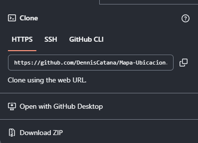

# Ubicación y coordenadas con Firebase 
## Para que el usuario pueda acceder a este aplicación debe seguir estos pasos.
1. Primero debera de clonarse este repositorio o descargar el zip del mismo.  

2. Una vez echo esto al usuario se le mostrara la estructura de este proyecto.  

3. Debera de ejecutar el comado nmp install para que se obtengan todas las librerias necesarias, una vez echo esto se mostrara un mensaje como este.  

4. Debera de tener un proyecto creado en Firebase con todo lo necesario. 

5. Se debera de poner sus credenciales en de firebase en los siguientes archivos los cuales estan en la ruta src/environments.

 - environment.ts  

 - environment.prod.ts 

6. Una vez realizada esta confihuraciones el usuario ejecutara el comando *ionic serve* y esperara a que en un navegadorse le muestre la siguiente pantalla.  

7. Debera hacer click en obtener ubicación y sus coordenadas y ubicacion se mostrara en el mapa y en la pantalla.
 
8. Se procede a verificar que se haya cuardado correctamente en la bdd de firebase

